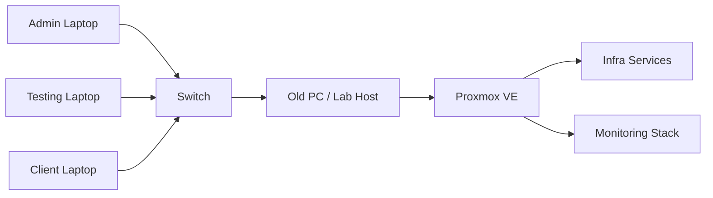

# AutoHotkey IT Workflow + Homelab Roadmap

Windows automation for IT support workflows and a future homelab automation journey.

This repository currently contains an [AutoHotkey v2 script](./AutoHotKey_Script%201.ahk) for day-to-day IT support tasks. It speeds up repeated ticket responses, opens the tools needed at the start of the day, and creates a dated note folder for quick documentation. It also serves as the starting point for a broader homelab and infrastructure automation path.

## Overview

This project is built around small, useful automations that remove repetitive work from a Windows-based IT workflow.

Today the repo is focused on:

- Faster text responses for recurring support situations
- A startup hotkey for opening core support tools
- Automatic creation of a dated work-notes folder
- A practical foundation for future homelab documentation and automation

## What It Does Today

The current script includes:

- Hotstrings for common support replies such as review/close, voicemail follow-up, and no-user-response closure
- A `Ctrl+L` startup workflow that creates a folder named with the current date
- Automatic creation of a `note.txt` file inside that daily folder
- Launching tools such as File Explorer, Outlook, a ticketing URL, LabTech, OneNote, 3CX, and Notepad

## Requirements

- Windows
- AutoHotkey v2
- Local app paths and URLs customized for your environment

This script is environment-specific by design, so expect to edit paths before using it on another machine.

## Quick Start

1. Install AutoHotkey v2 on Windows.
2. Clone or download this repository.
3. Open [AutoHotKey_Script 1.ahk](./AutoHotKey_Script%201.ahk) in a text editor.
4. Replace the hardcoded paths and URLs with your own values.
5. Run the script with AutoHotkey.
6. Test the hotstrings and press `Ctrl+L` to verify the startup workflow.

## Configuration Notes

Before using the script on your own system, replace personal or company-specific values with your local paths and tools.

Use placeholders like these when adapting the script:

```text
Notes folder: C:\Path\To\Notes\YY-MM-DD
Ticketing URL: https://your-ticketing-system.example
Remote support tool: C:\Program Files\YourTool\Tool.exe
Softphone: C:\Users\YourUser\AppData\Local\Programs\YourPhoneApp\Phone.exe
```

Recommended cleanup for the next revision of the script:

- Rename the script file to remove spaces
- Move all user paths to a small config section at the top
- Add comments in English or bilingual EN/FR for easier sharing
- Separate work-specific automation from personal lab automation as the repo grows

## Example Automations

Hotstring example:

```ahk
::manque de suivi::Manque de suivi de l'utilisateur, fermeture du ticket.
```

This expands a short trigger into a full support response so repeated ticket handling is faster and more consistent.

Startup workflow example:

```ahk
^l::
{
    TimeString := FormatTime(,"yy-MM-dd")
    todayPath := "C:\Path\To\Notes\" TimeString
    todayNote := todayPath "\note.txt"

    DirCreate todayPath
    FileAppend TimeString, todayNote

    Run "explorer.exe " todayPath
    Run "outlook.exe"
    Run "https://your-ticketing-system.example"
    Run "notepad.exe " todayNote
}
```

This pattern is a good base for building a repeatable IT morning routine.

## Future Homelab Roadmap

The next step is to grow this repo from workstation automation into a documented homelab journey.

Planned hardware roles:

- Old PC: primary lab host
- Switch: network segmentation and future VLAN practice
- Laptop 1: admin workstation
- Laptop 2: testing workstation
- Laptop 3: client/device simulation



Planned phases:

- Phase 1: install Proxmox VE on the old PC and document the base network and storage layout
- Phase 2: use the switch for cleaner network separation and hands-on segmentation practice
- Phase 3: add secure remote access with Tailscale instead of exposing services directly
- Phase 4: manage hosts and repeatable setup with Ansible inventory and playbooks
- Phase 5: add Prometheus and Grafana-based monitoring for Windows systems and lab services
- Phase 6: evaluate self-hosted apps from `awesome-selfhosted` based on real lab needs

Useful references for future implementation:

- [Proxmox VE](https://www.proxmox.com/en/products/proxmox-virtual-environment/overview)
- [Tailscale subnet routers](https://tailscale.com/docs/features/subnet-routers)
- [Ansible getting started](https://docs.ansible.com/projects/ansible/4/user_guide/intro_getting_started.html)
- [Prometheus getting started](https://prometheus.io/docs/tutorials/getting_started/)
- [Grafana Windows monitoring](https://grafana.com/docs/grafana-cloud/monitor-infrastructure/integrations/integration-reference/integration-windows-exporter/)
- [awesome-selfhosted](https://github.com/awesome-selfhosted/awesome-selfhosted)

## Next Improvements

- Add a small config block so paths and URLs can be changed without editing workflow logic
- Split hotstrings, startup automation, and future lab utilities into separate script files
- Add screenshots or a short GIF once the workflow is stable
- Create a `docs/` folder later for deeper homelab build notes, network diagrams, and service decisions
